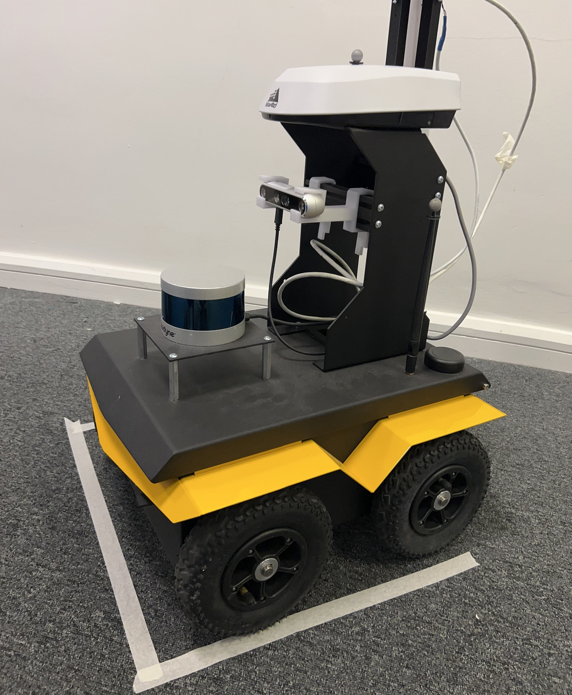

# Clearpath Jackal Bring-up

**Kausora Technologies** | ROS 2 bring-up and integration guide for the Clearpath Jackal UGV.

[](https://github.com/Kausora-Technologies/clearpath-jackal-bringup/actions/workflows/lint.yml)
[](https://github.com/Kausora-Technologies/clearpath-jackal-bringup/actions/workflows/links.yml)



---

## Overview

This repository provides a structured bring-up and validation workflow for the Clearpath Jackal Unmanned Ground Vehicle (UGV) using ROS 2. It is intended for robotics engineers, researchers, and integrators who need a reproducible process for deploying, configuring, and validating Jackal in development and field environments.

The guide covers workstation setup, robot network access, ROS 2 environment configuration, sensor validation, teleoperation, and navigation stack integration.

---

## Scope

| Area | Covered |
|---|---|
| Hardware bring-up and power-on | Yes |
| Workstation ROS 2 setup | Yes |
| Robot network access (SSH, Wi-Fi) | Yes |
| ROS 2 environment and DDS configuration | Yes |
| Platform driver bring-up | Yes |
| Sensor validation (IMU, GPS, LiDAR) | Yes |
| Teleoperation (keyboard and gamepad) | Yes |
| Navigation stack (Nav2) | Yes |
| SLAM (slam_toolbox) | Yes |
| RViz visualization | Yes |
| Troubleshooting | Yes |

---

## System Requirements

### Robot

| Component | Specification |
|---|---|
| Platform | Clearpath Jackal UGV |
| Onboard OS | Ubuntu 22.04 LTS |
| ROS Version | ROS 2 Humble Hawksbill |
| Onboard PC | Intel x86-64 (Mini-ITX) |
| Default IP | `192.168.131.1` |
| Default User | `administrator` |
| Default Password | `clearpath` |

### Workstation

| Component | Specification |
|---|---|
| OS | Ubuntu 22.04 LTS |
| ROS Version | ROS 2 Humble Hawksbill |
| Network | Same subnet as robot (`192.168.131.x`) |

---

## Repository Structure

```text
clearpath-jackal-bringup/
├── README.md                        # This document
├── LICENSE
├── docs/
│   ├── 01-system-overview.md        # Hardware overview and architecture
│   ├── 02-prerequisites.md          # Software dependencies and installation
│   ├── 03-workstation-setup.md      # Workstation ROS 2 configuration
│   ├── 04-robot-network-access.md   # SSH, Wi-Fi, and static IP setup
│   ├── 05-ros2-environment.md       # DDS, domain ID, environment variables
│   ├── 06-robot-bringup.md          # Starting platform drivers
│   ├── 07-sensor-validation.md      # Verifying sensor topics and data
│   ├── 08-teleoperation.md          # Keyboard and gamepad teleoperation
│   ├── 09-navigation-slam.md        # Nav2 and slam_toolbox integration
│   ├── 10-rviz-visualization.md     # RViz configuration and usage
│   ├── troubleshooting.md           # Common issues and resolutions
│   ├── safety-notes.md              # Operational safety requirements
│   └── validation-checklist.md      # Pre-deployment validation checklist
├── config/
│   └── robot.yaml.example           # Example Clearpath robot configuration
├── scripts/
│   └── setup_workstation.sh         # Workstation environment setup script
└── media/
    ├── clearpath_jackal.jpg          # Robot platform photo
    ├── basic_simulation.mp4          # Gazebo simulation demo
    ├── clearpath_jackal_benchmark.mp4  # Platform benchmark recording
    ├── ORB_SLAM3.mp4                 # ORB-SLAM3 live operation
    └── ORB_SLAM3_rosbag.mp4          # ORB-SLAM3 rosbag replay
```

---

## Bring-up Workflow

Follow these steps in order. Each step links to a detailed documentation page.

### Step 1 — System Overview

Review the hardware components, HMI panel indicators, and system architecture before powering on.

[docs/01-system-overview.md](docs/01-system-overview.md)

### Step 2 — Prerequisites

Install all required packages on both the workstation and verify the robot's onboard software.

[docs/02-prerequisites.md](docs/02-prerequisites.md)

```bash
# Workstation: Install ROS 2 Humble
sudo apt update && sudo apt install ros-humble-desktop

# Install Clearpath desktop packages
sudo apt install ros-humble-clearpath-desktop
```

### Step 3 — Workstation Setup

Configure your workstation environment for ROS 2 communication with the robot.

[docs/03-workstation-setup.md](docs/03-workstation-setup.md)

```bash
source /opt/ros/humble/setup.bash
echo "source /opt/ros/humble/setup.bash" >> ~/.bashrc
```

### Step 4 — Robot Network Access

Connect to Jackal via Ethernet (initial setup) or Wi-Fi, and verify SSH access.

[docs/04-robot-network-access.md](docs/04-robot-network-access.md)

```bash
# Initial wired connection — set workstation static IP to 192.168.131.51
ssh administrator@192.168.131.1
```

### Step 5 — ROS 2 Environment Configuration

Set `ROS_DOMAIN_ID` and verify DDS discovery between workstation and robot.

[docs/05-ros2-environment.md](docs/05-ros2-environment.md)

```bash
export ROS_DOMAIN_ID=0
export RMW_IMPLEMENTATION=rmw_fastrtps_cpp
```

### Step 6 — Robot Bring-up

Start the Clearpath platform drivers on the robot.

[docs/06-robot-bringup.md](docs/06-robot-bringup.md)

```bash
# On the robot (via SSH)
ros2 launch clearpath_robot robot.launch.py
```

### Step 7 — Sensor Validation

Verify all sensors are publishing on their expected topics.

[docs/07-sensor-validation.md](docs/07-sensor-validation.md)

```bash
# Verify active topics
ros2 topic list

# Check IMU data rate
ros2 topic hz /imu/data

# Verify LiDAR scan (if equipped)
ros2 topic echo /scan --once
```

### Step 8 — Teleoperation

Drive Jackal using keyboard or PS4/Xbox controller before autonomous operation.

[docs/08-teleoperation.md](docs/08-teleoperation.md)

```bash
# Keyboard teleoperation
ros2 run teleop_twist_keyboard teleop_twist_keyboard \
  --ros-args --remap cmd_vel:=/cmd_vel
```

### Step 9 — Navigation and SLAM

Launch the Nav2 navigation stack and slam_toolbox for autonomous navigation.

[docs/09-navigation-slam.md](docs/09-navigation-slam.md)

### Step 10 — RViz Visualization

Visualize robot state, sensor data, and navigation in RViz.

[docs/10-rviz-visualization.md](docs/10-rviz-visualization.md)

```bash
ros2 launch clearpath_viz view_model.launch.py
```

---

## Validation Checklist

A complete pre-deployment validation checklist is provided at:

[docs/validation-checklist.md](docs/validation-checklist.md)

Quick reference:

- [ ] Robot powers on; HMI LEDs cycle correctly
- [ ] SSH access confirmed over Ethernet or Wi-Fi
- [ ] `ros2 topic list` returns platform topics from workstation
- [ ] `/imu/data` publishing at expected rate
- [ ] `/odometry/filtered` publishing
- [ ] TF tree valid (`ros2 run tf2_tools view_frames`)
- [ ] `/scan` publishing (if LiDAR equipped)
- [ ] `/navsat/fix` publishing (GPS)
- [ ] Platform status topic healthy
- [ ] Teleoperation confirmed — robot moves as expected
- [ ] Emergency stop confirmed functional
- [ ] Nav2 stack launches without errors
- [ ] SLAM map builds correctly during manual drive

---

## Navigation and SLAM

Nav2 and SLAM integration details, including parameter configuration and map saving, are documented at:

[docs/09-navigation-slam.md](docs/09-navigation-slam.md)

Quick launch reference:

```bash
# SLAM (on workstation, robot running)
ros2 launch slam_toolbox online_async_launch.py \
  use_sim_time:=false

# Navigation with existing map
ros2 launch nav2_bringup navigation_launch.py \
  use_sim_time:=false \
  map:=/path/to/map.yaml
```

---

## Troubleshooting

Full troubleshooting guide: [docs/troubleshooting.md](docs/troubleshooting.md)

| Symptom | First Check |
|---|---|
| No topics on workstation | Verify `ROS_DOMAIN_ID` matches on both machines |
| Robot not reachable via SSH | Check static IP assignment (`192.168.131.51`) |
| IMU not publishing | Check `/diagnostics` and USB device connections |
| TF tree broken | Confirm platform launch completed successfully |
| Nav2 costmap empty | Verify `/scan` topic and TF transforms are valid |
| Robot not responding to `cmd_vel` | Check motor enable state and e-stop status |

---

## Safety Notes

Full safety documentation: [docs/safety-notes.md](docs/safety-notes.md)

- Always perform an e-stop test before any autonomous operation.
- Keep the PS4 controller paired and within range during field testing.
- Maintain a minimum 2-metre safety clearance during autonomous navigation.
- The Jackal can reach speeds of up to 2.0 m/s — do not operate in confined spaces at full speed.
- Disconnect battery before opening the chassis or connecting external hardware.
- Do not exceed the 20 kg payload capacity.

---

## Media

### Platform Benchmark

<video src="media/clearpath_jackal_benchmark.mp4" controls width="100%"></video>

### Simulation (Gazebo)

<video src="media/basic_simulation.mp4" controls width="100%"></video>

### Visual SLAM — ORB-SLAM3

<video src="media/ORB_SLAM3.mp4" controls width="100%"></video>

<video src="media/ORB_SLAM3_rosbag.mp4" controls width="100%"></video>

---

## Official Documentation

| Resource | Link |
|---|---|
| Clearpath Jackal ROS 2 Docs | [docs.clearpathrobotics.com](https://docs.clearpathrobotics.com/docs/ros2humble/ros/) |
| Clearpath Platform Software | [docs.clearpathrobotics.com](https://docs.clearpathrobotics.com/docs/ros/installation/overview) |
| ROS 2 Humble Documentation | [docs.ros.org](https://docs.ros.org/en/humble/) |
| Nav2 Documentation | [docs.nav2.org](https://docs.nav2.org/) |
| slam_toolbox | [github.com/SteveMacenski/slam_toolbox](https://github.com/SteveMacenski/slam_toolbox) |
| ROS 2 DDS / RMW | [docs.ros.org](https://docs.ros.org/en/humble/Concepts/About-Different-Middleware-Vendors.html) |
| Jackal Hardware User Manual | [docs.clearpathrobotics.com](https://docs.clearpathrobotics.com/docs_robots/outdoor_robots/jackal/user_manual_jackal/) |

---

## License

The documentation, configuration examples, and scripts in this repository are authored by **Kausora Technologies** and licensed under the MIT License — see [LICENSE](LICENSE).

This repository is an independent integration guide and is not affiliated with or endorsed by Clearpath Robotics. Jackal is a product of Clearpath Robotics / Otto Motors. All Clearpath product names, trademarks, and documentation remain the property of their respective owners.

---

*For support or questions, open an issue on [GitHub](https://github.com/Kausora-Technologies/clearpath-jackal-bringup/issues).*
